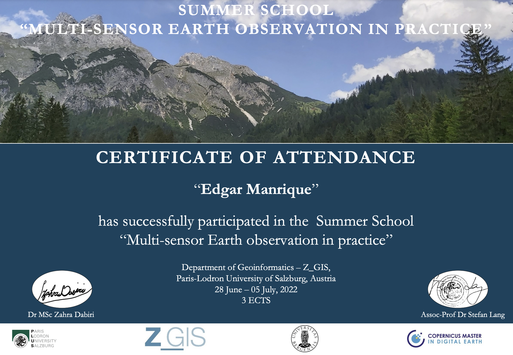

## Summer School description

From the 28th of June to the 5th of July 2022, the Multi-sensor Earth Observation in Practice Summer School 
took place at the University of Salzburg. The topics were very varied and included: 

- June 28th: Satellite Image Time Series and Data Cubes
- June 29th: Landslide mapping and radar interferometry
- June 30th: Glacier mapping and UAV remote sensing
- July 1st: Field trip, UAV data collection
- July 4th: UAV data processing and soft skills development
- July 5th: Final presentation at GI-Salzburg

Additionally to lectures and practice sessions, a field trip to the village of Werfenweg took place on the 1st of July to put in 
practice some of the skills learned in UAV data collection and Landslide mapping. The last session of the Summer School took 
place at the GI-Salzburg conference and the summer school participants performed a group presentation on one of the topics
studied in the previous days. 

The group presentation is shared publicly in this [link](https://docs.google.com/presentation/d/1PXJswGYgMt_b4YgkVeATi3lK0NWTRz_6kl3Aeh_eu5k/edit?usp=sharing).

