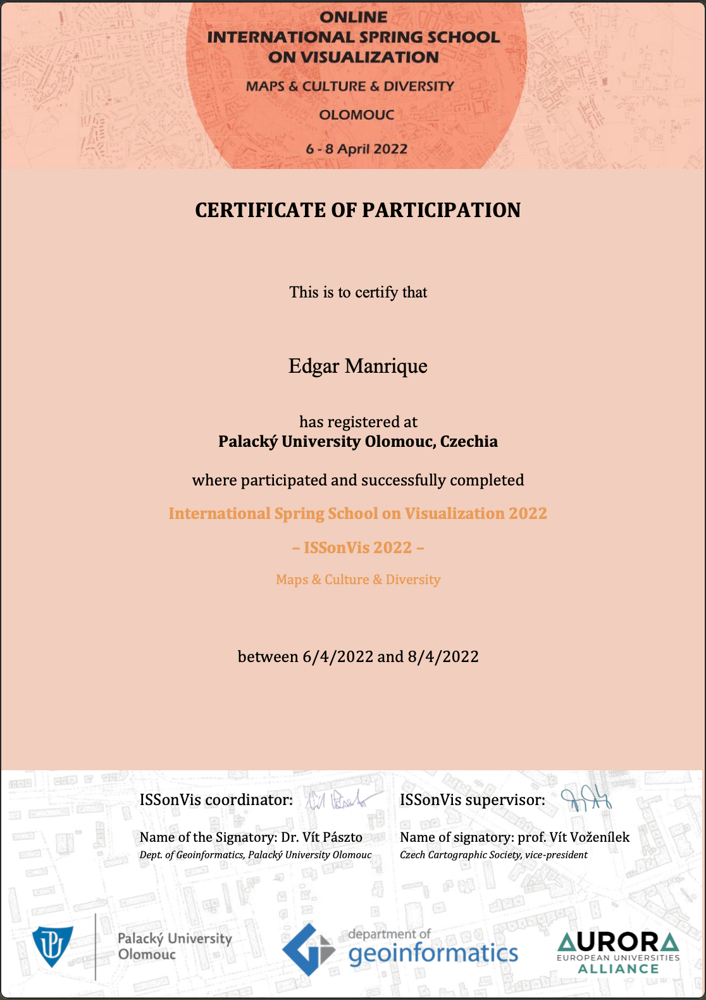

## Summer School description

From the 6th to the 8th of April 2022, the Online International Spring School on Visualization took 
place Online and was orginized by the department of Geoinformatics at Palacky Olomouc University. The topics included: 

- April 6th: Maps in culture and history
- April 7th: Maps in Literature, visualising names
- April 8th: Virtual PubQuiz

